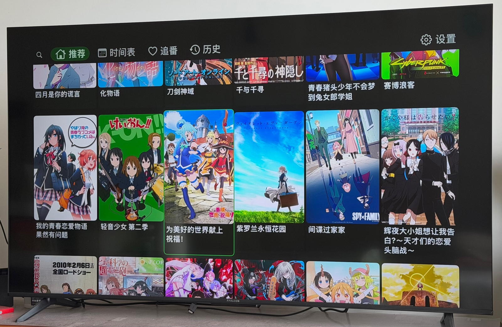
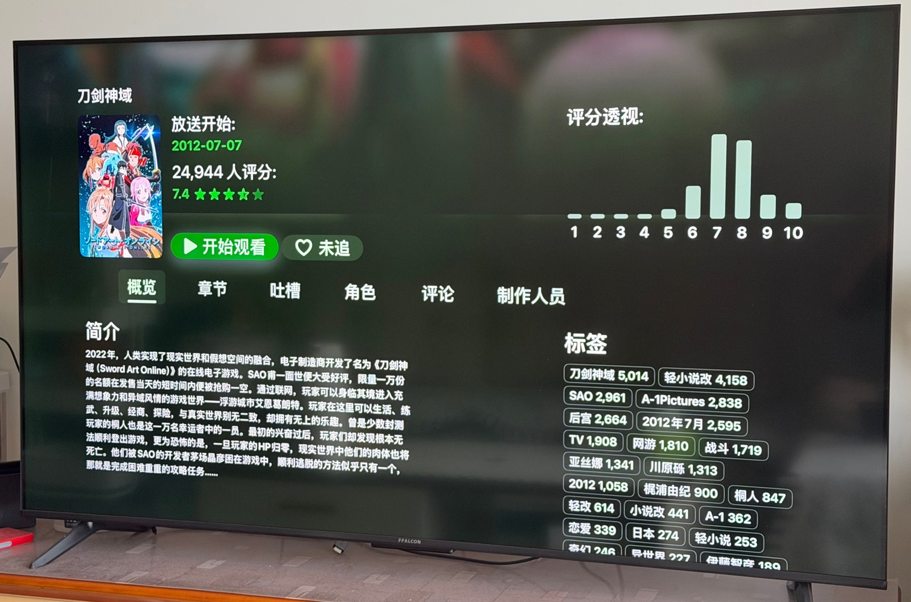
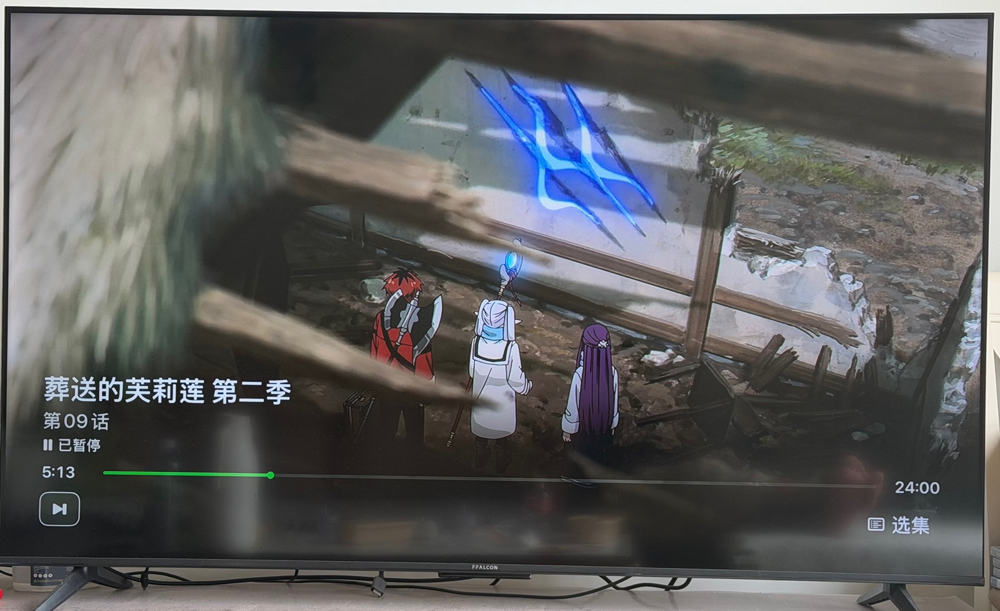

# KazumiTV

> 注意：此项目与 [Kazumi](https://github.com/Predidit/Kazumi) 并非同一作者，为经过原作者同意开发的 Apple TV 移植版本。

KazumiTV 是 [Kazumi](https://github.com/Predidit/Kazumi) 的独立 Apple TV/tvOS 移植版本，使用 Swift 与 SwiftUI 重新实现。

本仓库与原 Kazumi 项目独立维护，并非由 Kazumi 原作者或原维护团队开发、维护或发布。本移植版本已获得原作者同意，原项目来源与归属信息同时记录在 [NOTICE](NOTICE) 中。

## 项目状态

KazumiTV 目前处于活跃开发阶段。应用面向 tvOS 平台，由于 tvOS 无法在应用内直接执行与桌面端相同的网页解析和 JavaScript 工作流，因此项目使用本地或服务端代理来解析视频 URL。

## 使用截图

以下截图仅用于展示 KazumiTV 在 Apple TV 真机上的界面效果，截图中的媒体画面与海报版权归原权利方所有。

| 推荐页 | 详情页 | 播放器 |
| --- | --- | --- |
|  |  |  |

## 架构

- tvOS 应用：Swift、SwiftUI、MVVM
- 导航：基于 `NavigationStack` 与共享 Router
- 插件解析：通过 Fuzi 进行 XPath 解析
- 本地存储：SQLite.swift 与 UserDefaults
- 图片加载与缓存：Kingfisher
- 服务器代理：Python Flask + Playwright，位于 `kazumi-server/`

## 环境要求

- Xcode 15 或更新版本
- tvOS 17.0 或更新版本
- [XcodeGen](https://github.com/yonaskolb/XcodeGen)
- Python 3，用于可选的服务器代理
- Playwright Chromium，用于服务端网页解析

## 构建

生成 Xcode 项目：

```bash
xcodegen generate
```

构建 Apple TV 模拟器版本：

```bash
xcodebuild -project KazumiTV.xcodeproj \
  -scheme KazumiTV \
  -configuration Debug \
  -destination 'platform=tvOS Simulator,name=Apple TV 4K (3rd generation)' \
  build
```

## 服务器代理

代理服务器位于 `kazumi-server/`。

```bash
cd kazumi-server
./start.sh
```

默认情况下，服务器会尝试使用 `5001` 端口。在 tvOS 应用设置中配置代理服务器地址，例如：

```text
http://192.168.1.100:5001
```

如果需要自定义服务端口，可以在启动服务器时传入 `--port` 或 `-p`：

```bash
cd kazumi-server
./start.sh --port 6000
```

然后在 tvOS 应用设置中填写对应端口：

```text
http://192.168.1.100:6000
```

如需限制监听地址，也可以传入 `--host`。例如只允许本机访问：

```bash
./start.sh --host 127.0.0.1 --port 6000
```

在真实 Apple TV 设备上测试时，请使用运行服务器的 Mac 或主机的局域网 IP 地址。

## 与 Kazumi 的关系

KazumiTV 是原 [Kazumi](https://github.com/Predidit/Kazumi) 项目的 Swift/tvOS 移植版本。请不要将本仓库与上游 Kazumi 项目混淆：

- 原项目：[Predidit/Kazumi](https://github.com/Predidit/Kazumi)
- KazumiTV：独立维护的 tvOS 移植版本
- 开发许可：本移植版本已获得原作者同意
- 作者关系：KazumiTV 与 Kazumi 不是同一项目，也不是由同一作者或团队维护

## 免责声明

KazumiTV 不托管、不分发、也不提供任何媒体内容。插件规则、数据源及相关网络请求均由用户自行配置和承担责任。用户必须遵守所在地法律法规，以及其所配置第三方来源的服务条款。

## 许可证

KazumiTV 使用 GNU General Public License version 3 授权，与原 Kazumi 项目使用的许可证保持一致。详见 [LICENSE](LICENSE)。

原 Kazumi 项目及其贡献者保留其在原项目中的相应权利。
